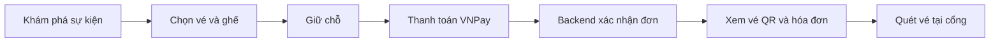
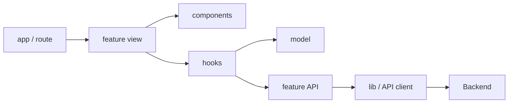

<p align="center">
  
</p>

# SmartEvent · Web

Giao diện khám phá sự kiện, mua vé, quản lý chương trình và kiểm soát vé tại cổng. Repository này chứa **frontend** của SmartEvent; backend và hạ tầng local được quản lý độc lập.

> **Trạng thái:** dự án đang phát triển ở môi trường local. Giao diện đã kết nối nhiều API thật, nhưng chưa được xác nhận hoàn chỉnh bằng kiểm thử đầu cuối trên staging. Xem [việc còn mở](#việc-cần-hoàn-tất-trước-khi-phát-hành-công-khai) trước khi phát hành.

## Chức năng theo vai trò

| Vai trò | Chức năng |
| --- | --- |
| Khách tham quan | Tìm kiếm sự kiện, xem hạng vé, đợt bán và số vé còn lại. |
| Người mua | Đăng ký/đăng nhập, cập nhật ảnh đại diện, chọn vé đứng hoặc ghế, giữ chỗ, thanh toán VNPay, xem đơn, vé QR, hóa đơn và gửi yêu cầu hỗ trợ hoàn tiền. |
| Ban tổ chức | Tạo sự kiện, chọn hoặc tạo địa điểm, tải ảnh, cấu hình khu vực/ghế/hạng vé/đợt bán, gửi duyệt và theo dõi tồn kho. Có thể tạo thêm đợt bán khi sự kiện đã mở bán nhưng chưa bắt đầu và vẫn còn sức chứa. |
| Quản trị viên | Duyệt sự kiện, quản lý danh mục, tìm người dùng và cấp role, theo dõi outbox, xử lý yêu cầu hoàn tiền. |
| Nhân viên cổng | Chọn sự kiện/cổng, quét mã vé và xem lịch sử check-in. |



Frontend lấy trạng thái thanh toán và vé từ backend; URL trả về của VNPay không tự xác nhận giao dịch. Backend kiểm tra lại hạn mức mua và tình trạng ghế khi giữ chỗ.

## Các repository

- Frontend (repo này): `smartevent-web`
- Backend: [smartevent-backend](https://github.com/smartevent-ticketing/smartevent-backend)
- Hạ tầng local: [smartevent-infra](https://github.com/smartevent-ticketing/smartevent-infra)

Xem [bảng đối chiếu chức năng FE/BE](docs/FEATURE_COMMIT_MAP.md) để tìm commit, API và màn hình tương ứng khi cần sửa từng phần.

## Công nghệ

- Next.js 16 App Router
- React 19 và TypeScript
- Tailwind CSS 4
- shadcn/Base UI primitives
- ESLint và TypeScript type checking

## Chạy local

Yêu cầu: Node.js **24.13.1**, được chốt trong `.node-version` và `package.json`; npm; backend và hạ tầng local đang chạy. Dùng cùng phiên bản Node ở local và CI.

```powershell
npm ci
Copy-Item .env.example .env.local
npm run dev
```

Trên macOS/Linux, thay `Copy-Item` bằng `cp`. Mở `http://localhost:3000` sau khi development server khởi động.

Hạ tầng và backend nên được chạy trước theo hướng dẫn trong `smartevent-infra`. URL API local mặc định là `http://localhost:8080`.

| Biến trong `.env.local` | Mục đích | Giá trị local |
| --- | --- | --- |
| `API_BASE_URL` | Next.js gọi backend ở runtime qua các route `/api/auth/*` và `/api/v1/*`. | `http://localhost:8080` |

Nếu backend chạy ở địa chỉ khác, sửa `API_BASE_URL` trước khi khởi động frontend. Biến này chỉ dùng phía server và phải trỏ tới địa chỉ backend mà tiến trình Next.js truy cập được. Trình duyệt gọi API trên cùng địa chỉ với frontend; `NEXT_PUBLIC_API_BASE_URL` không còn được sử dụng. Không đưa token, mật khẩu hoặc khóa VNPay vào `NEXT_PUBLIC_*`; `.env.local` đã được Git bỏ qua.

### Chia sẻ frontend qua Dev Tunnels

Chia sẻ port **3000** rồi mở URL HTTPS của tunnel. Next.js chuyển tiếp `/api/v1/*` tới backend qua `API_BASE_URL`; các route `/api/auth/*` vẫn xử lý đăng nhập và cookie phiên. Backend phải đang chạy và truy cập được từ tiến trình Next.js. Nếu cả hai chạy trực tiếp trên cùng máy, giữ `API_BASE_URL=http://localhost:8080`; nếu Next.js chạy trong container, dùng địa chỉ backend trên mạng container.

Sau khi lấy bản sửa hoặc đổi `.env.local`, dừng và khởi động lại `npm run dev`, rồi tải lại trang trên tunnel. Ảnh tải lên MinIO cần địa chỉ riêng mà trình duyệt truy cập được: cấu hình backend `APP_MINIO_PUBLIC_ENDPOINT` bằng URL HTTPS của dịch vụ MinIO. Chỉ chia sẻ port 3000 chưa làm cho URL ảnh `localhost:9000` truy cập được từ máy khác.

## Kiểm tra trước khi push

```powershell
npm run lint
npm run format:check
npm run typecheck
npm test
npm run build
```

Có thể chạy toàn bộ bằng `npm run check`. `typecheck` tạo lại route types của Next.js trước khi kiểm tra TypeScript, kể cả ở checkout mới chưa có `.next`.

GitHub Actions chạy cùng năm bước trên cho pull request và khi đẩy lên `main`, cài dependency bằng `npm ci`. Build không yêu cầu địa chỉ API hoặc backend đang chạy; kiểm tra này chưa xác nhận tích hợp backend.

Không commit `.env.local`, token hoặc secret; biến có tiền tố `NEXT_PUBLIC_` luôn có thể xuất hiện trong bundle trình duyệt. Khi triển khai, cấu hình `API_BASE_URL` trong môi trường chạy Next.js; Docker image không cần build lại khi địa chỉ backend thay đổi.

## Cấu trúc chính

```text
src/
├── app/                 # route group, page, layout, auth và API proxy handlers
├── features/
│   ├── account/         # vé, đơn, hóa đơn, hồ sơ, hỗ trợ hoàn tiền
│   ├── admin/           # duyệt, danh mục, người dùng, outbox
│   ├── auth/            # phiên đăng nhập và biểu mẫu xác thực
│   ├── booking/         # chọn ghế, giỏ vé, giữ chỗ, checkout
│   ├── catalog/         # danh mục và trang chi tiết sự kiện
│   ├── checkin/         # quét mã và lịch sử check-in
│   ├── orders/          # API đơn hàng dùng chung giữa các luồng
│   ├── organizer/       # tạo và quản lý sự kiện
│   └── payments/        # khởi tạo và xác minh thanh toán VNPay
├── components/          # UI và bố cục dùng chung
├── hooks/               # hook dùng chung không sở hữu nghiệp vụ
└── lib/                 # HTTP client, auth, thời gian và tiện ích

tests/                   # kiểm thử hành vi và hồi quy
public/                  # tài nguyên tĩnh
```

Trong mỗi `feature`, `api/` gọi HTTP, `model/` giữ quy tắc nghiệp vụ thuần, `hooks/` điều phối trạng thái, `components/` hiển thị giao diện và `*-view.tsx` ghép màn hình. `application/` hoặc `services/` chỉ xuất hiện khi cần phối hợp nhiều nguồn dữ liệu. `index.ts` là phần giao tiếp công khai với feature khác; quy tắc thuần dùng chung có thể được xuất qua `model/index.ts`. Mã trong cùng feature import trực tiếp file cần dùng. Không cần tạo đủ mọi thư mục cho feature nhỏ hoặc chia file theo một giới hạn số dòng tùy ý.

Phần quản lý đợt bán hiện tách danh sách, form tạo, thẻ cấu hình hạng vé, hook điều phối và quy tắc sức chứa. Phần khu vực/ghế tách giao diện, hộp thoại và hook thao tác; ảnh sự kiện tách giao diện khỏi xử lý tải/sắp xếp. Dashboard ban tổ chức tách thẻ chỉ số, sự kiện nổi bật và bảng lọc. Màn đặt vé tách danh sách hạng vé, giỏ hàng và hộp chọn ghế; phép tính tồn kho/hạn mức nằm trong `model/`.



## Quy tắc thêm hoặc sửa tính năng

1. Route chọn màn hình và truyền tham số. View ghép các component, hook điều phối state và API, model xử lý quy tắc độc lập.
2. Trong `features`, chỉ thư mục `api/` được gọi `fetch` hoặc import transport client. ESLint kiểm tra quy tắc này; model cũng bị cấm phụ thuộc React, Next, API, hooks và component.
3. Đọc contract từ `src/lib/api/schema.d.ts`; cập nhật bằng `npm run api:generate` khi backend thay đổi. Các contract bổ sung tạm thời nằm trong `src/lib/api/*-contract.ts`; đối chiếu lại khi cập nhật schema. Lệnh tạo schema cần backend chạy ở `http://localhost:8080`.
4. API mutation phải kiểm tra HTTP lỗi trước khi cập nhật giao diện thành công. Tái sử dụng `requireApiSuccess` và `getApiErrorMessage`.
5. Dữ liệu có thể hết hiệu lực cần xử lý request bị hủy hoặc kết quả cũ. Trạng thái thanh toán lấy từ backend; đồng hồ và query string không xác nhận giao dịch thành công.
6. Thay đổi quy tắc chọn vé, xử lý thanh toán, QR, đăng nhập hoặc biểu mẫu cần thêm test hành vi tương ứng.

Wizard tạo sự kiện lưu bản nháp bằng `POST /api/v1/events` để có mã sự kiện cho ảnh. Khi gửi duyệt, FE gọi một lần `POST /api/v1/events/{eventId}/complete-setup`; backend tạo khu vực, ghế, hạng vé, đợt bán và chuyển sang chờ duyệt trong cùng một giao dịch. Nếu lỗi, bản nháp và ảnh vẫn có thể mở để sửa; cấu hình vé của lần gửi lỗi không được lưu dở. FE cũng lấy giới hạn vé theo sự kiện và đợt bán của tài khoản trước khi đặt, còn backend kiểm tra lại lúc giữ chỗ.

Màn quản trị có thao tác sửa danh mục và cấp thêm role cho người dùng. Quyền mới có hiệu lực sau khi tài khoản đăng nhập lại; màn hình hiện chỉ cấp thêm role, chưa thu hồi role. Ban tổ chức chọn địa điểm có sẵn hoặc tạo địa điểm ngay trong wizard sự kiện. Ban tổ chức cũng có thể tạo thêm đợt bán khi sự kiện đã xuất bản nhưng chưa bắt đầu; vé đã bán hoặc đang giữ chỗ của đợt đóng vẫn chiếm sức chứa. Các thao tác này gọi API thật và hiển thị lỗi từ máy chủ khi không đủ quyền hoặc vượt sức chứa.

## Kiểm thử

`tests/*.test.mjs` chạy bằng Node test runner. Loader `tests/register-typescript.mjs` dùng TypeScript đã cài để đọc module TS/TSX, alias `@/` và import không có phần mở rộng giống mã ứng dụng. Loader chỉ chuyển đổi cú pháp; `npm run typecheck` vẫn là bước bắt buộc để kiểm tra kiểu.

Bộ test bao phủ chọn đúng đợt bán/tồn kho, sức chứa, giới hạn và ghế đặt chỗ, giữ nguyên token QR, phân loại kết quả thanh toán và retry/hủy polling, deadline, lỗi API, biểu mẫu sự kiện và đăng nhập. Các component thuần có thể render qua `react-dom/server` để kiểm tra nội dung và ngữ nghĩa truy cập; không cần thêm dependency.

Các test này không thay thế kiểm thử trình duyệt hoặc tích hợp backend. Trước khi phát hành, cần chạy trên staging các luồng đăng nhập/khôi phục phiên, đặt ghế đồng thời, hết hạn giữ chỗ, thanh toán/callback, truy cập lại đơn đã trả tiền, check-in QR thật và phân quyền theo vai trò.

## Việc cần hoàn tất trước khi phát hành công khai

- Cần có bản **Điều khoản dịch vụ** và **Chính sách bảo mật** chính thức. Hiện form đăng ký vẫn có liên kết `#` cho hai tài liệu này; chưa có trang nội dung. Thay bằng trang thật và rà soát lại bước xác nhận điều khoản trước khi mở đăng ký công khai. Không dùng nội dung pháp lý tự tạo để thay thế bản được chủ dự án duyệt.
- Cần chốt ý nghĩa và cách áp dụng `ticket_phase_rules` ở backend trước khi mở giao diện cấu hình quy tắc bán vé. API hiện lưu quy tắc nhưng bước giữ chỗ chưa kiểm tra. Hộp thư thông báo trong ứng dụng cũng cần thiết kế API và trạng thái đã đọc; hiện chưa có endpoint cho FE kết nối.
- Kiểm tra toàn bộ luồng với backend và VNPay trên môi trường staging: đăng nhập → giữ chỗ → callback → phát hành vé → email/hóa đơn → check-in. Theo xác nhận của chủ dự án, email vé đã có ảnh QR ở local; cần xác nhận lại luồng này trên staging cùng các bước còn lại.
- Chạy thử mua đồng thời và hết hạn giữ chỗ với backend để xác minh tồn kho, tính nhất quán và thời gian phản hồi. Bộ test frontend không đo được RabbitMQ hoặc xử lý đồng thời phía server.
- Hoàn tiền đi qua yêu cầu hỗ trợ và được quản trị viên cập nhật; giao diện không tự động refund. Cổng thanh toán đang tập trung vào **VNPay**; VietQR là lựa chọn xem xét sau.

## Đóng góp

Trước khi sửa tính năng, đọc README này và `AGENTS.md`. Giữ thay đổi trong đúng feature, cập nhật hợp đồng API khi backend đổi, thêm test cho quy tắc nghiệp vụ bị ảnh hưởng và chạy `npm run check` trước khi gửi pull request. Không commit `.env.local` hoặc dữ liệu nhạy cảm.
